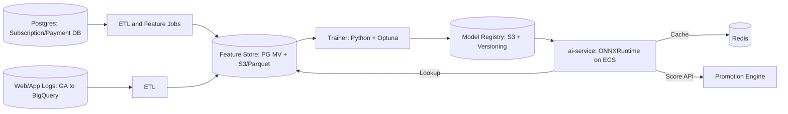

# 📑 중간보고서: 구독 해지 예측 모델 개발 및 프로모션 자동화

## 1. 배경

### 1.1 AI 기반 구독 해지 예측 도입 배경
- **AI 운영 기반 확보**: 기존 서버 개발팀은 AI 경험이 없어, 이번 과제를 통해 **운영 솔루션 및 MLOps 파이프라인**을 구축함으로써 향후 다양한 AI 기능 도입의 기반을 마련.  
- **데이터 확보 현황**: 구독 결제 및 상태 변경 데이터(`~25.8`)를 준실시간으로 동기화 완료. 현재는 구독 상태와 결제 이력을 단순 제공하는 수준.  
- **과제 필요성**: PoC 단계에서 **해지율 예측 모델**의 효과를 검증하고, PM/개발 리더와 함께 도입 여부를 최종 결정.  
- **추가 목표**: AI App Specialist 과제와 연계하여 신규 기능 제안 및 운영계 반영 여부 검토.  

### 1.2 구독허브 서비스 성과 개선 배경
- 구독허브의 **Active User 증대**와 **해지율 감소**가 핵심 과제.  
- 현재 프로모션은 존재하나, **효율적 타겟팅 부족**으로 비용 대비 효과가 낮음.  
- **해지 위험군 사용자에게 선제적으로 프로모션 제공** → 전체 해지율 감소 + 프로모션 효율 극대화 기대.  

---

## 2. 과제 목표

- **목표 정의**  
  구독허브의 결제, 상품, 상태 데이터와 웹 행동로그(검색, FAQ, 해지페이지 방문)를 통합하여 **구독 해지 위험 시점을 예측**하고, 위험도가 높은 사용자에게 자동으로 **쿠폰·프로모션을 제공**하는 시스템 구축.  

- **모델 구조**  
  - 시계열 + 정적 피처 기반 앙상블 (LSTM/GRU + GBDT)  
  - 매월 파인튜닝 및 경량화 후 **ECS 기반 추론 API 서빙**  
  - 오프라인 배치 점수(일 단위) + 실시간 트리거 점수(세션 내 개입) 병행  

- **모델 KPI**  
  - ROC-AUC ≥ 0.78  
  - PR-AUC ≥ baseline + 30%  
  - Precision@TopK ≥ 0.35  

- **서비스 KPI**  
  - 해지율 10% 감소  
  - 위험군 프로모션 전환율 +3pp  
  - 발송량 30% 절감  

---

## 3. 시스템 아키텍처

- **Redis**: 실시간 API 추론 시 최신 사용자 점수를 빠르게 제공 (ms 단위 응답 필요).
- **Postgres MV**: 일배치 점수 및 리포트 제공용, 대시보드·분석 쿼리에 활용.
- **GA → BigQuery 연동**: 행동로그 데이터를 ETL하여 Feature Store에 적재.

------

## 4. 데이터 모델 & 스키마

- **TBIL_SBSC_PMT_HIST_L**: 결제/환불/쿠폰 사용 이력
- **TBIL_SBSC_STAT_L**: 구독 상태, 시작일·종료일, 다음 결제일
- **TBIL_SBSC_PROD_SWTCH_L**: 구독 상품 변경 이력
- **TBIL_PROD_M / TBIL_PROD_CNTR_L**: 상품 메타, 가격, 국가별 속성

➡️ 이 테이블들과 GA 로그를 ETL로 가공하여 feature store(S3/PG MV)에 적재.

------

## 5. 데이터 파이프라인

- **라벨링**
  - 해지일(`SBSC_END_DT`) N일 전 → `label=1`
  - 그 외 → `label=0`
- **피처 (Rolling Window)**
  - 결제: 실패/성공 횟수, 쿠폰/환불 금액, 평균 결제액
  - 상품: 전환 횟수, 다운그레이드 여부
  - 구독 상태: 종료일 근접, 다음 결제일 지연 여부
  - 행동로그 (GA 기반)
    - `cancel_keyword_search_cnt_14d`
    - `faq_cancel_views_14d`
    - `cancel_page_visit_14d`
    - `session_duration_mean_14d`
- **저장소**
  - 학습용: S3/Parquet
  - 서빙용: Redis 캐시(실시간), Postgres MV(배치/분석)

------

## 6. 모델 설계 및 운영

- **앙상블 구조**
  - GBDT: 정적/범주형 변수 처리 (상품, 가격, 결제수단 등)
  - LSTM: 시계열 패턴 처리 (결제주기, 상태변경 등)
  - 앙상블 결합으로 예측 안정성 확보
- **월 단위 파인튜닝 관리 방안**
  - Airflow 등 워크플로우 관리도구로 월 배치 DAG 구성
  - Optuna 기반 자동 하이퍼파라미터 탐색
  - 검증 후 모델 레지스트리 등록 → ECS 자동 배포
- **ONNX 변환 + INT8 양자화**
  - 이유: 추론 속도 개선 + 메모리 절감
  - 변환/양자화 코드 적용 (ONNXRuntime)

------

## 7. API 설계

- `POST /api/v1/churn/score` → 사용자별 위험 점수 제공
- `POST /api/v1/promotion/recommend` → 점수 기반 프로모션 추천
- `POST /api/v1/message/generate` → RAG 기반 개인화 메시지 생성

------

## 8. 프로모션 엔진

- 위험군 + 해지페이지 방문 → 쿠폰 발급
- 월 1회 제한, 대시보드에서 룰 수정 가능

------

## 9. LLM+RAG

- 코퍼스: FAQ, 약관, 쿠폰 조건
- Embedding: e5-base / Ko-SBERT
- Vector index: pgvector
- LLM: 7B 한국어 모델 LoRA 파인튜닝
- Guardrails: 응답 길이 제한, 금지어 필터

------

## 10. 프론트엔드

- Angular UI: 점수, 원인, CTA(Call To Action) 표시
- 관리자 페이지: 임계치/룰 조정, A/B 테스트 지원

------

## 11. 보안 및 운영

- PII 암호화, RBAC 적용
- 감사로그(ai_action_log) 기록
- 성능 목표: p95 응답 < 200ms

------

## 12. 테스트 계획

- 단위: API 응답 정확성
- 통합: ETL → 모델 → API → 프로모션 흐름
- 성능: 200 RPS 이상 처리

------

## 13. 향후 계획 / 연구 보완

- **사용자 행동로그 확장 활용**
  - 현재 GA 기반으로 **검색·FAQ 조회·해지페이지 방문·세션시간** 데이터를 수집 가능
  - GA → BigQuery Export → ETL → Feature Store → 모델 학습에 반영 예정
  - 로그인 빈도는 GA 기본 이벤트로 확보 불가하므로 제외
- **예상 효과**
  - 행동 데이터 반영 시 해지 의도 탐지 정밀도 향상 (특히 PR-AUC 개선 기대)
  - 추후 실험적으로 “행동로그만 활용한 서브모델” 연구 가능